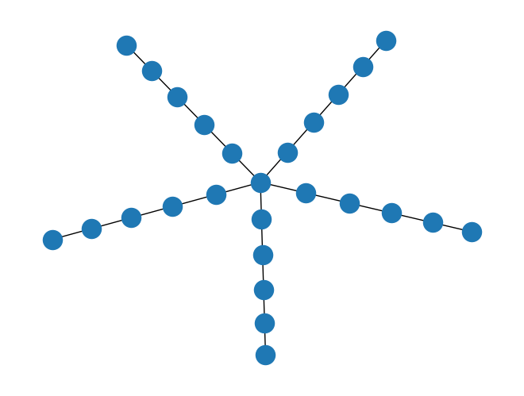
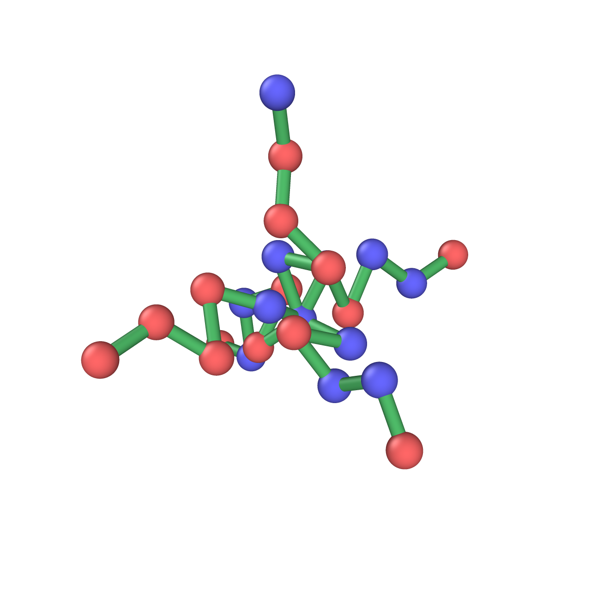

# graph2lammps

This program enables the generation of LAMMPS input data based on networkx graphs.

## Install Instructions
Installation with `pip`:
```shell
git clone git@github.com:sjiang87/graph2lammps.git
cd graph2lammps
pip install -e .
```

## Quickstart
```python
import numpy as np
import networkx as nx
from graph2lammps.convert import gen_pos, write_pdb, write_lammps
```

1. Create a polymer graph, e.g., a star polymer:
    ```python
    def gen_star(num_arm, len_branch):
        G = nx.Graph()
        G.add_node(0)

        for i in range(1, num_arm + 1):
            arm = nx.path_graph(len_branch)
            arm = nx.relabel_nodes(arm, {j: i*len_branch + j for j in range(len_branch)})
            G = nx.union(G, arm)
            G.add_edge(0, i*len_branch)
        return G

    G = gen_star(num_arm=5, len_branch=5)
    ```

2. Assign properties to each node or edge. This can be done after graph creation or directly in the custom 'gen_star' function.

    ```python
    for node in G.nodes():
        G.nodes[node]['type'] = random.randint(1, 2) # bead type 1 or 2
        G.nodes[node]['name'] = string.ascii_uppercase[G.nodes[node]['type'] ] # some random node names
        
    for edge in G.edges():
        G.edges[edge]['type'] = random.randint(1, 2) # bond type 1 or 2

    G.graph['mass'] = {1: 1, 2:2} # graph-level metadata, e.g., bead mass, charge
    ```

3. Create node position matrix:
    ```python
    pos = gen_pos(G, rmin=0.5, bdist=1.0, bmin=0.9, bmax=1.1, niter=1000)
    ```

    ```
    rmin : float
        Minimum separation distance between polymer beads.
    bdist : float
        Ideal bond distance between connected polymer beads.
    bmin : float
        Minimum bond length.
    bmax : float
        Maximum bond length.
    niter : int
        Number of iterations for position generation.
    ```

4. Write LAMMPS data file.
    ```python
    write_lammps(G, pos, fname='your/dir/sys.data')
    ```

The above-mentioned procedure can be completed by:
```python
from graph2lammps import graph2lammps

G = gen_star(num_arm=5, len_branch=5)
graph2lammps(G, rmin=0.5, bdist=1.0, bmin=0.9, bmax=1.1, niter=1000, fname='your/dir/sys.data)
```

<div style="display: flex; justify-content: center;">
    
    
</div>


## TODO
- Currently supports bead/atom and bond types. Support for angles, dihedrals, and other types will be added.
- An executable command will be added to convert a pickled file containing multiple graphs to multiple LAMMPS data files.


## Contribution
If you need to add additional functionality, please contact sj0161@princeton.edu or submit a pull request.